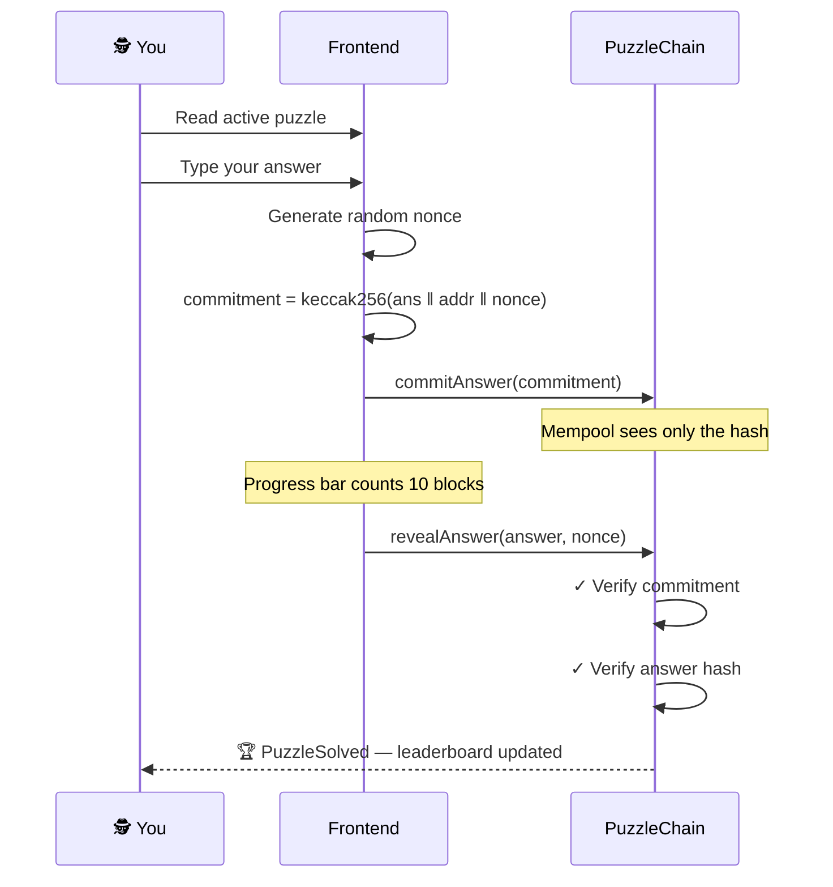

<div align="center">

```
╔══════════════════════════════════════════════════════════════════╗
║        ░ CLASSIFIED ░  CASE FILE #0001  ░ SEASON 01 ░           ║
╚══════════════════════════════════════════════════════════════════╝
```

# ⬡ CHAIN DETECTIVE

**An On-Chain Alternate Reality Game · Monad Testnet**

[](https://monad-arg.vercel.app)
[](https://monad.xyz)
[](https://nextjs.org)
[](https://typescriptlang.org)
[](https://soliditylang.org)

*A live anomaly has been detected on-chain.*
*Decode transactions. Commit your answer. Break the seal.*

</div>

---

## 🕵️ THE CASE

CHAIN DETECTIVE is a live **on-chain Alternate Reality Game** where every puzzle, every answer, and every solve is recorded permanently on the **Monad Testnet** blockchain.

There are **100 puzzles** spanning cryptography, blockchain math, EVM internals, and classic algorithms. One puzzle is active at a time. The first agent to crack it and verify their answer on-chain earns their place in the **Evidence Vault leaderboard** — and a share of the season prize pool.

> No answer is ever broadcast to the mempool.
> The commit-reveal protocol ensures nobody can copy your solution mid-flight.

---

## ⚙️ THE PROTOCOL — COMMIT / REVEAL

The entire mechanic is built around **front-running prevention**. You never send your raw answer to the blockchain directly.

```
╔─ PHASE 01 ─── SEAL THE EVIDENCE ────────────────────────────────────╗
│                                                                      │
│  1. Solve the puzzle off-chain                                       │
│  2. Generate a random nonce (32 bytes)                               │
│  3. Compute: commitment = keccak256( answer ‖ your_address ‖ nonce ) │
│  4. Submit commitAnswer(commitment) → only the hash goes on-chain    │
│                                                                      │
│  ✦ Validators see nothing useful. Your answer stays hidden.          │
╚──────────────────────────────────────────────────────────────────────╝

                   ⏳ Wait 10 blocks (~5 seconds)

╔─ PHASE 02 ─── BREAK THE SEAL ───────────────────────────────────────╗
│                                                                      │
│  5. Call revealAnswer( answer, nonce )                               │
│  6. Contract recomputes the hash → verifies it matches Phase 1       │
│  7. Contract checks keccak256(answer) == stored puzzle answer hash   │
│  8. ✓ SOLVED — your address is written into the on-chain record      │
╚──────────────────────────────────────────────────────────────────────╝
```



---

## 🗂️ CASE FILES — 100 PUZZLES · 7 CATEGORIES

| # | Category | Puzzles | What You'll Crack |
|:-:|----------|:-------:|-------------------|
| 01 | **Monad Architecture** | 15 | Chain ID math, BFT quorum, block production rates |
| 02 | **Monad Math** | 20 | Number theory, base conversion, Fibonacci on Monad values |
| 03 | **Monad Cryptography** | 15 | keccak256 hashes, hex encoding, Base64, XOR operations |
| 04 | **Monad Economics** | 10 | TPS economics, gas burns, fee calculations |
| 05 | **EVM & Solidity** | 15 | Opcodes, storage slots, function selectors, gas costs |
| 06 | **Bitcoin & Ethereum** | 10 | Halvings, Merkle trees, EIP-1559, chain IDs |
| 07 | **Pure Algorithms** | 15 | DP, sorting, Kadane's, LCS, Tower of Hanoi |

> **Every puzzle is solvable with an AI assistant.**
> Copy the puzzle text → paste into ChatGPT / Claude / Gemini → ask for only the final answer → submit on-chain.

---

## 🎮 FIELD PROTOCOL — HOW TO PLAY

### 1 · Get a Wallet

Install [MetaMask](https://metamask.io) or any EVM-compatible browser wallet.
Get free testnet **MON** tokens for gas from the [Monad faucet](https://faucet.monad.xyz).

### 2 · Add Monad Testnet

| Parameter | Value |
|-----------|-------|
| Network Name | `Monad Testnet` |
| RPC URL | `https://testnet-rpc.monad.xyz` |
| Chain ID | `10143` |
| Currency Symbol | `MON` |
| Block Explorer | `https://testnet.monadexplorer.com` |

### 3 · Open the Active Case

Go to **[Case Files](https://monad-arg.vercel.app/play)** and read the current puzzle description loaded from the smart contract.

### 4 · Crack the Puzzle

Each puzzle tells you exactly what to compute and what format the answer should be in.

```
Example ──────────────────────────────────────────────────────────
  Puzzle:  "Monad testnet chain ID is 10143.
            Compute the sum of its decimal digits."

  Format:  integer

  Prompt:  "10143 — sum its decimal digits. Answer only."
  Answer:  9
───────────────────────────────────────────────────────────────────
```

### 5 · Seal the Evidence — Phase 1

Type your answer in the **Interrogation Terminal** on the play page.
Click **SEAL EVIDENCE** → confirm the transaction in your wallet.
A hidden commitment is submitted to the blockchain. Your answer stays private.

### 6 · Break the Seal — Phase 2

Watch the block progress bar fill up (10 blocks · ~5 seconds on Monad).
When it shows **SEAL READY TO BREAK** → click **BREAK THE SEAL** → confirm.
The contract verifies your commitment and answer simultaneously.

### 7 · Claim Your Place

If correct — your address is written on-chain and appears in the **[Field Agents leaderboard](https://monad-arg.vercel.app/leaderboard)** with your score.

---

> [!TIP]
> Use the **[Surveillance Feed](https://monad-arg.vercel.app/explore)** to watch live Monad Testnet transactions in real time. ARG contract interactions are highlighted — you can see other agents committing and revealing as it happens.

> [!WARNING]
> Do **not** close the tab or switch wallets between Phase 1 and Phase 2. Your commitment data (answer + nonce) is stored locally in the browser. If lost, you must re-commit with a new transaction.

> [!NOTE]
> Each player can have only one active commitment at a time. If a puzzle is solved by someone else before you reveal, the case advances and your commit is invalidated — start fresh on the next puzzle.

---

## 🔬 SMART CONTRACTS

Three contracts work together on Monad Testnet:

```
PuzzleChain      Stores puzzles, manages commit/reveal, tracks solvers
PlayerRegistry   On-chain leaderboard — sorted top-10, O(1) reads
ARGGame          Season management, prize pool with pull-payment pattern
```

**Security properties:**

| Property | Implementation |
|----------|---------------|
| Front-running protection | Commitment hides the answer until after the block delay |
| Replay protection | Commitment encodes `msg.sender` — can't be copied by another address |
| Brute-force protection | Random 32-byte nonce makes commitments unguessable |
| Safe prize distribution | Winner calls `claimPrize()` — no push-transfer DoS risk |
| Ownership safety | Two-step `transferOwnership` + `acceptOwnership` |

---

## 🛠️ LOCAL DEVELOPMENT

```bash
# Clone the repository
git clone https://github.com/Swindle96/monad-arg.git
cd monad-arg

# Install dependencies
npm install

# Set up environment variables
cp .env.example .env.local
```

Edit `.env.local`:

```env
NEXT_PUBLIC_PUZZLE_CONTRACT=0x...
NEXT_PUBLIC_ARG_GAME=0x...
NEXT_PUBLIC_PLAYER_REGISTRY=0x...
NEXT_PUBLIC_RPC_URL=https://testnet-rpc.monad.xyz
NEXT_PUBLIC_SITE_URL=http://localhost:3000
```

```bash
# Start dev server
npm run dev

# Type-check
npm run type-check

# Run e2e tests (first time only: npx playwright install)
npm test
```

---

## 🧱 TECH STACK

| Layer | Technology |
|-------|-----------|
| Framework | Next.js 14 — App Router, SSR + client components |
| Language | TypeScript |
| Blockchain interaction | wagmi v2 + viem |
| Wallet UI | ConnectKit |
| Styling | Tailwind CSS + CSS custom properties |
| Smart contracts | Solidity 0.8.20, compiled with Foundry |
| End-to-end tests | Playwright |
| Deployment | Vercel |

---

<div align="center">

```
CHAIN_DETECTIVE  ·  SEASON 01  ·  MONAD TESTNET
The clues are hidden in the blockchain. Find them.
```

[](https://monad-arg.vercel.app/play)
[](https://monad-arg.vercel.app/leaderboard)
[](https://monad-arg.vercel.app/explore)

</div>
